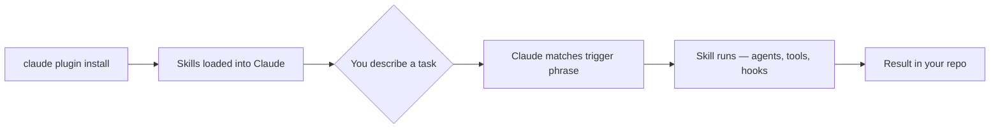

<h1 align="center">Kamanga Marketplace</h1>

<p align="center">
  
  
  
</p>

<p align="center">Personal fork of <a href="https://github.com/Roxabi/roxabi-plugins">Roxabi-plugins</a> by <a href="https://github.com/kamangacode">Kamanga</a> — adapted with custom plugins and workflows for personal use.</p>

## Credits & Attribution

> **All plugins in this marketplace were originally developed by [Roxabi](https://github.com/Roxabi).**
>
> This repository is a personal fork of [Roxabi/roxabi-plugins](https://github.com/Roxabi/roxabi-plugins). Kamanga did **not** author the plugins shipped here (`dev-core`, `web-intel`, `compress`, `1b1`) — they are the work of the Roxabi team. This fork exists solely to:
>
> - Curate a subset of Roxabi plugins suited to my personal workflow
> - Add my own plugins and customizations on top
> - Track my own changes independently of upstream
>
> If you're looking for the canonical, fully-maintained marketplace with the complete plugin catalog, **use the upstream directly**:
>
> ```bash
> claude plugin marketplace add Roxabi/roxabi-plugins
> ```
>
> Huge thanks to Roxabi for the open-source work this fork is built on.

## Why this fork

Roxabi ships an excellent set of plugins, but I only need a handful of them for my own projects, and I want to layer my own personal skills/agents on top without polluting the upstream. Forking lets me:

- Keep only the plugins I actually use day-to-day
- Add Kamanga-specific plugins and workflows
- Pull in upstream improvements selectively when needed

## Quick Start

```bash
# 1. Add the marketplace (once per machine)
claude plugin marketplace add kamangacode/kamanga-plugins

# 2. Install the plugin you need
claude plugin install dev-core        # full dev lifecycle (by Roxabi)
claude plugin install web-intel       # URL research + analysis (by Roxabi)
claude plugin install compress        # token-efficient skill notation (by Roxabi)
claude plugin install 1b1             # walk items one by one (by Roxabi)
```

Then trigger any skill by describing what you want — no slash commands to memorize:

```
"start working on issue #42"    → /dev
"improve readme"                → /readme-upgrade
"sync docs after this refactor" → /doc-sync
"scrape and summarize this URL" → /summarize
```

## How it works

Each plugin is self-contained: it ships **skills** (trigger-phrase workflows), **agents** (specialized sub-processes), and optionally **hooks** (automated guardrails that run on every tool call). Claude Code discovers and loads them automatically on install.



Plugins are project-agnostic: they read your stack from `.claude/stack.yml` at runtime and adapt to your framework, package manager, and file layout. The same `dev-core` plugin works on a NestJS monorepo and a Django service.

## Plugins

All plugins below are authored and maintained by [Roxabi](https://github.com/Roxabi). Source: [Roxabi/roxabi-plugins](https://github.com/Roxabi/roxabi-plugins).

### Development lifecycle

| Plugin | Description | Author |
|--------|-------------|--------|
| [dev-core](plugins/dev-core/README.md) | Full dev workflow — frame, analyze, spec, plan, implement, review, ship. 29 skills, 9 agents, safety hooks. Project-agnostic via `stack.yml`. | [Roxabi](https://github.com/Roxabi) |

### Research & analysis

| Plugin | Description | Author |
|--------|-------------|--------|
| [web-intel](plugins/web-intel/README.md) | Multi-platform URL scraper + 8 analysis skills (scrape, summarize, analyze-url, explain, roast, benchmark, adapt, video-analyze). | [Roxabi](https://github.com/Roxabi) |

### Utilities

| Plugin | Description | Author |
|--------|-------------|--------|
| [compress](plugins/compress/README.md) | Rewrite agent/skill definitions using compact math/logic notation to reduce token usage. | [Roxabi](https://github.com/Roxabi) |
| [1b1](plugins/1b1/README.md) | Walk through a list of items one by one — brief, decide, execute, repeat. | [Roxabi](https://github.com/Roxabi) |

## Contributing

This is a **personal fork**. Issues, PRs, and feature requests for the plugins themselves should go to the upstream repository: [Roxabi/roxabi-plugins](https://github.com/Roxabi/roxabi-plugins).

For Kamanga-specific additions or customizations, see [CONTRIBUTING.md](CONTRIBUTING.md).

## License

MIT — same as upstream. See [LICENSE](LICENSE).
