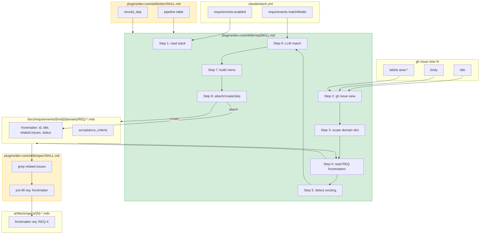
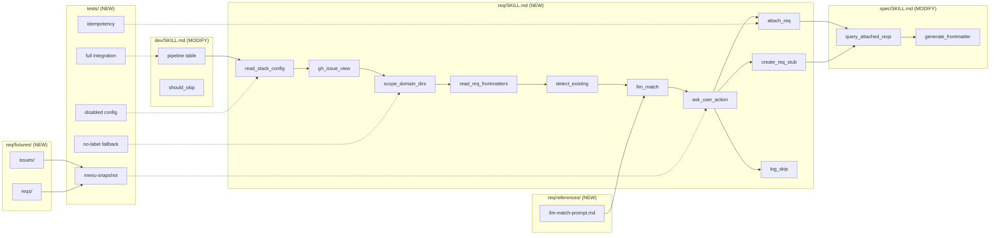

## Summary

Implémente un nouveau skill `/req #N` (autonome + invoqué par `/dev`) qui détecte les REQ existants via labels `area:*` + LLM scoring (`claude-haiku-4-5`), propose attach/create-stub/skip via AskUserQuestion, et mute directement les fichiers `docs/requirements/{functional,non-functional}/{domain}/REQ-*.mdx`. Override `dev/SKILL.md` (pipeline + skip rules) et `spec/SKILL.md` (consommation `req:` frontmatter via grep). 4 slices V1→V4 livrés en une PR.

## Architecture

### Data flow



### File × Function map



## Bootstrap Context

From [analysis](../analyses/1-dev-requirements-substep-analysis.mdx) — Shape 1 retenu : skill autonome `/req` + override minimal de `dev/SKILL.md`. Persistance directe dans REQ files (pas d'artifact Σ séparé). Activation conditionnelle via `stack.yml.requirements.enabled`.

Dépendances externes (résolues hors plan) :
- Convention REQ `crmcoaching` (frontmatter Zod ADR-048+049) — figée
- `_template.mdx` REQ — disponible dans `crmcoaching/docs/requirements/`
- Plugin local fork dev-core — actif dans `kamanga-plugins/.claude/settings.json`

Référence patterns (à lire en Wave 1) :
- `plugins/dev-core/skills/frame/SKILL.md` — artifact generation pattern
- `plugins/dev-core/skills/triage/SKILL.md` — issue read + file mutation pattern
- `plugins/dev-core/skills/spec/SKILL.md` — frontmatter pre-fill pattern

## Agents

| Agent | Tasks | Files |
|-------|-------|-------|
| backend-dev-A | T1, T3-T12, T17-T20 | `req/SKILL.md` (sequential authoring) |
| backend-dev-B | T2, T23-T28, T30-T32 | `dev/SKILL.md`, `spec/SKILL.md` |
| architect-A | T16 | `req/references/llm-match-prompt.md` |
| tester-A | T13-T15, T21-T22, T38-T42 | `req/fixtures/`, manual snapshot tests |
| tester-B | T29, T33 | RED-GATEs V3, V4 |
| doc-writer-A | T34-T36 | `plugins/dev-core/README.md`, `req/README.md` |
| devops-A | T37 | `./sync-plugins.sh --local` |

Total : 7 agent instances, max 4 parallel par wave.

## Wave Structure

9 waves, max 4 parallel agents. Elapsed ~5h vs ~9h sequential.

| Wave | Trigger | Agents | Tasks |
|------|---------|--------|-------|
| 1 | start | 2 ∥ | backend-dev-A: T1 · backend-dev-B: T2 |
| 2 | Wave 1 done | 4 ∥ | backend-dev-A: T3→T4→T5→T6→T7→T8→T9→T10→T11→T12 · tester-A: T13→T14 · architect-A: T16 · backend-dev-B: T23→T24→T25→T26→T27→T28 |
| 3 | Wave 2 (V1 + V3 logic) done | 1 | tester-A: T15 (V1 RED-GATE) |
| 4 | Wave 3 done | 2 ∥ | backend-dev-A: T17→T18→T19→T20 · tester-B: T29 (V3 RED-GATE) |
| 5 | Wave 4 done | 1 | tester-A: T21→T22 (V2 RED-GATE) |
| 6 | Wave 5 done | 1 | backend-dev-B: T30→T31→T32 |
| 7 | Wave 6 done | 1 | tester-B: T33 (V4 RED-GATE) |
| 8 | Wave 7 done | 3 ∥ | doc-writer-A: T34→T35→T36 · devops-A: T37 · tester-A: T38→T39→T40→T41 |
| 9 | Wave 8 done | 1 | tester-A: T42 (final RED-GATE) |

## Consistency Report

12 success criteria from spec → all traced to ≥1 micro-task. 0 untraced. 0 exemptions.

| SC | Description | Traced to |
|----|-------------|-----------|
| SC-1 | `/req #42` propose menu avec REQ + create + skip | T9, T15 |
| SC-2 | Attach idempotent | T10, T15, T39 |
| SC-3 | Create stub avec frontmatter pré-rempli | T11, T15 |
| SC-4 | Skip with reason loggé dans frame | T12, T15 |
| SC-5 | `/dev #42` (F-lite) exécute le step automatiquement | T29, T42 |
| SC-6 | `/dev #99` (Tier S) skip silencieux | T29 |
| SC-7 | `stack.yml.requirements.enabled ≠ true` skip | T41 |
| SC-8 | LLM model = `claude-haiku-4-5` configurable | T17, T20 |
| SC-9 | `pnpm requirements:matrix` reflète attachments | T42 |
| SC-10 | README documente activation + override delta | T34, T35, T36 |
| SC-11 | Tests fixtures snapshot + assertions | T13, T15, T21, T38 |
| SC-12 | Re-run détecte attachment, propose `[Keep existing]` | T8, T9, T39 |

Bidirectional check : ∀ task → traces vers ≥1 SC ou support (bootstrap, docs, devops).

## Micro-Tasks

### Bootstrap

#### T1 — Read pattern skills (frame, triage)

- **Description** : Lire `plugins/dev-core/skills/frame/SKILL.md` et `skills/triage/SKILL.md` pour identifier les conventions AskUserQuestion + mutation d'artifact.
- **File** : (read-only)
- **Verify** : `grep -c "AskUserQuestion" plugins/dev-core/skills/frame/SKILL.md plugins/dev-core/skills/triage/SKILL.md`
- **Expected** : count > 0 dans les deux
- **Time** : 5 min · `[P]` · backend-dev-A · Spec trace : bootstrap · Slice : — · Phase : RED · Difficulty : 1

#### T2 — Read REQ frontmatter contract

- **Description** : Lire le `_template.mdx` REQ + Zod schema dans `crmcoaching/docs/requirements/` (référence cross-repo) pour figer le contrat frontmatter.
- **File** : (read-only)
- **Verify** : noter dans plan : `id, title, domain, status, priority, acceptance_criteria, related.{issues,specs,adrs}, sources`
- **Expected** : champs identifiés
- **Time** : 5 min · `[P]` · backend-dev-B · Spec trace : bootstrap · Slice : — · Phase : RED · Difficulty : 1

### V1 — Standalone skill, label-only détection

#### T3 — Scaffold `req/SKILL.md`

- **Description** : Créer `plugins/dev-core/skills/req/SKILL.md` avec frontmatter (`name: req`, triggers `/req`, args `--issue N`) + outline 8 steps (placeholders).
- **File** : `plugins/dev-core/skills/req/SKILL.md`
- **Code snippet** :
  ```markdown
  ---
  name: req
  description: Identify or create REQ for an issue (attach/create-stub/skip)
  triggers: ["/req", "requirements", "attach REQ"]
  ---

  ## Pipeline

  1. Read stack config
  2. Read issue
  3. Scope domain dirs
  4. Read REQ frontmatters
  5. Detect existing attachment
  6. LLM match (V2)
  7. Build menu
  8. Attach / Create / Skip
  ```
- **Verify** : `test -f plugins/dev-core/skills/req/SKILL.md && grep -c "^## " plugins/dev-core/skills/req/SKILL.md`
- **Expected** : ≥ 1 section header
- **Time** : 5 min · backend-dev-A · Spec trace : U1, N1-N10 · Slice : V1 · Phase : RED · Difficulty : 1

#### T4 — Step 1: read stack config

- **Description** : Écrire la section "Step 1 — Read stack config" : lit `.claude/stack.yml`, extrait `requirements.{enabled,root,validateCmd,matchModel}`. Si `enabled` ≠ true → skip silently.
- **File** : `plugins/dev-core/skills/req/SKILL.md`
- **Verify** : `grep -A5 "Step 1" plugins/dev-core/skills/req/SKILL.md`
- **Expected** : section présente, mentionne `enabled` et skip path
- **Time** : 8 min · backend-dev-A · Spec trace : N1, S1, SC-7 · Slice : V1 · Phase : RED · Difficulty : 2

#### T5 — Step 2: read issue

- **Description** : Section "Step 2 — Read issue" : `gh issue view N --json title,body,labels` → variables locales.
- **File** : `plugins/dev-core/skills/req/SKILL.md`
- **Verify** : `grep "gh issue view" plugins/dev-core/skills/req/SKILL.md`
- **Expected** : commande présente avec `--json title,body,labels`
- **Time** : 5 min · backend-dev-A · Spec trace : N2, S2 · Slice : V1 · Phase : RED · Difficulty : 1

#### T6 — Step 3: scope domain dirs

- **Description** : Section "Step 3 — Scope domain dirs" : labels `area:X` → `{root}/functional/X/`. Multi-label = union. Pas de label = scan global (warn).
- **File** : `plugins/dev-core/skills/req/SKILL.md`
- **Verify** : `grep -A5 "Step 3" plugins/dev-core/skills/req/SKILL.md`
- **Expected** : 3 cas couverts (label, multi-label, no-label)
- **Time** : 8 min · backend-dev-A · Spec trace : N3, SC-7 (no-label fallback) · Slice : V1 · Phase : RED · Difficulty : 2

#### T7 — Step 4: read REQ frontmatters

- **Description** : Section "Step 4 — Read REQ frontmatters" : glob `*.mdx` dans dirs, parse YAML frontmatter, skip+warn invalid (Zod fail).
- **File** : `plugins/dev-core/skills/req/SKILL.md`
- **Verify** : `grep -A8 "Step 4" plugins/dev-core/skills/req/SKILL.md`
- **Expected** : mention glob + parse + invalid handling
- **Time** : 8 min · backend-dev-A · Spec trace : N4, S3 · Slice : V1 · Phase : RED · Difficulty : 2

#### T8 — Step 5: detect existing attachment

- **Description** : Section "Step 5 — Detect existing" : grep `related.issues:.*\bN\b` dans tous les REQ → liste IDs déjà attachés.
- **File** : `plugins/dev-core/skills/req/SKILL.md`
- **Verify** : `grep "related.issues" plugins/dev-core/skills/req/SKILL.md`
- **Expected** : pattern grep documenté
- **Time** : 5 min · backend-dev-A · Spec trace : SC-12 · Slice : V1 · Phase : RED · Difficulty : 2

#### T9 — Step 7: build menu

- **Description** : Section "Step 7 — Build menu" : construit options AskUserQuestion : pour chaque REQ candidat → `[Attach REQ-X: title]`, plus `[Create new REQ stub]`, `[Skip with reason]`. Si attach existant → `[Keep existing attachment]` en premier.
- **File** : `plugins/dev-core/skills/req/SKILL.md`
- **Verify** : `grep -c "AskUserQuestion" plugins/dev-core/skills/req/SKILL.md`
- **Expected** : ≥ 1
- **Time** : 10 min · backend-dev-A · Spec trace : U1, N6, SC-1, SC-12 · Slice : V1 · Phase : RED · Difficulty : 3

#### T10 — Step 8a: attach action

- **Description** : Section "Step 8a — Attach" : lit REQ-X.mdx, mute `related.issues` (ajout idempotent), réécrit. Préserve l'ordre des autres clés frontmatter.
- **File** : `plugins/dev-core/skills/req/SKILL.md`
- **Verify** : `grep -A6 "Step 8a" plugins/dev-core/skills/req/SKILL.md`
- **Expected** : section + mention idempotence
- **Time** : 10 min · backend-dev-A · Spec trace : N7, SC-2 · Slice : V1 · Phase : RED · Difficulty : 3

#### T11 — Step 8b: create-stub action

- **Description** : Section "Step 8b — Create stub" : lit `_template.mdx`, calcule next ID (max numéro + 1 dans dossier domaine), pré-remplit `id, title, domain, sources, related.issues=[N]`, met ACs en `[NEEDS CLARIFICATION]`.
- **File** : `plugins/dev-core/skills/req/SKILL.md`
- **Verify** : `grep -A8 "Step 8b" plugins/dev-core/skills/req/SKILL.md`
- **Expected** : section + mention next ID + ACs marker
- **Time** : 10 min · backend-dev-A · Spec trace : N8, U3, SC-3 · Slice : V1 · Phase : RED · Difficulty : 3

#### T12 — Step 8c: skip-with-reason

- **Description** : Section "Step 8c — Skip" : prompt AskUserQuestion U2 pour reason, append `## Requirements skipped` au frame artifact avec reason + ISO timestamp.
- **File** : `plugins/dev-core/skills/req/SKILL.md`
- **Verify** : `grep "Requirements skipped" plugins/dev-core/skills/req/SKILL.md`
- **Expected** : pattern présent
- **Time** : 8 min · backend-dev-A · Spec trace : U2, N9, S5, SC-4 · Slice : V1 · Phase : RED · Difficulty : 2

#### T13 — Create fixtures

- **Description** : Créer `plugins/dev-core/skills/req/fixtures/issues/{42-with-label,43-no-label,44-multi-label}.json` (3 issues) + `fixtures/reqs/REQ-BOOKING-{001,002,003}.mdx` + `REQ-AUTH-{001,002}.mdx` (5 REQs : 1 clear-match avec issue 42, 1 partiel, 3 non-match).
- **File** : `plugins/dev-core/skills/req/fixtures/`
- **Verify** : `ls plugins/dev-core/skills/req/fixtures/issues/ plugins/dev-core/skills/req/fixtures/reqs/ | wc -l`
- **Expected** : ≥ 8 fichiers
- **Time** : 15 min · `[P]` · tester-A · Spec trace : SC-11 · Slice : V1 · Phase : RED · Difficulty : 2

#### T14 — Walk fixtures, capture expected menus

- **Description** : Pour chaque issue fixture, dérouler manuellement les Steps 1-7 → écrire `fixtures/expected-menus.md` listant les options AskUserQuestion attendues.
- **File** : `plugins/dev-core/skills/req/fixtures/expected-menus.md`
- **Verify** : `test -f plugins/dev-core/skills/req/fixtures/expected-menus.md && grep -c "^## Issue" plugins/dev-core/skills/req/fixtures/expected-menus.md`
- **Expected** : 3 sections (1 par issue)
- **Time** : 15 min · tester-A · Spec trace : SC-11 · Slice : V1 · Phase : RED · Difficulty : 2

#### T15 — RED-GATE V1 demo

- **Description** : Demo V1 : exécuter mentalement `/req --issue 42` (label-mode) sur fixture, vérifier (a) menu = expected, (b) attach idempotent (re-run = no-op), (c) create-stub produit YAML valide, (d) skip log dans frame artifact.
- **File** : (verification only, écrire résultat dans `fixtures/v1-demo-results.md`)
- **Verify** : `test -f plugins/dev-core/skills/req/fixtures/v1-demo-results.md && grep "PASS" plugins/dev-core/skills/req/fixtures/v1-demo-results.md | wc -l`
- **Expected** : 4 PASS (a-d)
- **Time** : 20 min · tester-A · Spec trace : SC-1, SC-2, SC-3, SC-4 · Slice : V1 · Phase : **RED-GATE** · Difficulty : 3

### V2 — LLM scoring

#### T16 — Design LLM matching prompt

- **Description** : Écrire `plugins/dev-core/skills/req/references/llm-match-prompt.md` avec : prompt template (input = issue title+body + REQ frontmatters compact ; output = JSON `[{id, score 0-1, reason}]`), 3 few-shot examples (clear-match, partial, no-match).
- **File** : `plugins/dev-core/skills/req/references/llm-match-prompt.md`
- **Verify** : `test -f plugins/dev-core/skills/req/references/llm-match-prompt.md && grep -c "few-shot\|example" plugins/dev-core/skills/req/references/llm-match-prompt.md`
- **Expected** : ≥ 3 examples
- **Time** : 20 min · architect-A · Spec trace : N5, S4, Q2 · Slice : V2 · Phase : RED · Difficulty : 4

#### T17 — Step 6: LLM match

- **Description** : Insérer dans `req/SKILL.md` la "Step 6 — LLM match" entre Step 5 et Step 7. Lit le prompt depuis `references/llm-match-prompt.md`, appelle `claude-haiku-4-5` (modèle configurable via `stack.yml.requirements.matchModel`), parse JSON output.
- **File** : `plugins/dev-core/skills/req/SKILL.md`
- **Verify** : `grep -A8 "Step 6" plugins/dev-core/skills/req/SKILL.md`
- **Expected** : section + mention `claude-haiku-4-5` + prompt path
- **Time** : 10 min · backend-dev-A · Spec trace : N5, SC-8 · Slice : V2 · Phase : GREEN · Difficulty : 3

#### T18 — Scoring cutoffs

- **Description** : Ajouter section "Scoring cutoffs" : `≥ 0.8` = high (présenté en premier, label "match"), `0.3 ≤ score &lt; 0.8` = low (présenté avec "low confidence"), `&lt; 0.3` = hidden (sauf si tout est &lt;0.3 → fallback : présenter top-2).
- **File** : `plugins/dev-core/skills/req/SKILL.md`
- **Verify** : `grep -E "0\.8|0\.3" plugins/dev-core/skills/req/SKILL.md`
- **Expected** : 2+ matches
- **Time** : 8 min · backend-dev-A · Spec trace : TD-5, Q1 · Slice : V2 · Phase : GREEN · Difficulty : 2

#### T19 — Update menu construction with scoring

- **Description** : Modifier Step 7 "Build menu" pour ranker par score, insérer label confidence (`(match)`, `(low confidence)`) dans le `description` de chaque option.
- **File** : `plugins/dev-core/skills/req/SKILL.md`
- **Verify** : `grep -E "match|confidence" plugins/dev-core/skills/req/SKILL.md`
- **Expected** : ≥ 2 occurrences
- **Time** : 10 min · backend-dev-A · Spec trace : N6, U1 · Slice : V2 · Phase : GREEN · Difficulty : 3

#### T20 — Document `stack.yml.requirements.matchModel`

- **Description** : Ajouter section "Configuration" en bas de `req/SKILL.md` documentant tous les keys `stack.yml.requirements.{enabled,root,validateCmd,matchModel}` avec valeurs par défaut.
- **File** : `plugins/dev-core/skills/req/SKILL.md`
- **Verify** : `grep -A4 "Configuration" plugins/dev-core/skills/req/SKILL.md`
- **Expected** : 4 keys documentés
- **Time** : 8 min · backend-dev-A · Spec trace : SC-8 · Slice : V2 · Phase : REFACTOR · Difficulty : 1

#### T21 — Run LLM match on fixtures, capture scores

- **Description** : Pour chaque issue fixture, exécuter manuellement le prompt LLM contre les REQ candidats, capturer les scores réels dans `fixtures/v2-llm-scores.md`. Valider que les cutoffs séparent correctement les matches.
- **File** : `plugins/dev-core/skills/req/fixtures/v2-llm-scores.md`
- **Verify** : `test -f plugins/dev-core/skills/req/fixtures/v2-llm-scores.md && grep -c "score:" plugins/dev-core/skills/req/fixtures/v2-llm-scores.md`
- **Expected** : 3 issues × 5 REQs = 15 scores
- **Time** : 25 min · tester-A · Spec trace : SC-11, Q1 · Slice : V2 · Phase : RED · Difficulty : 4

#### T22 — RED-GATE V2 demo

- **Description** : Demo V2 : (a) scores produits cohérents avec fixtures, (b) ranking applique cutoffs, (c) low-confidence labellé. Écrire résultat dans `fixtures/v2-demo-results.md`.
- **File** : `plugins/dev-core/skills/req/fixtures/v2-demo-results.md`
- **Verify** : `grep "PASS" plugins/dev-core/skills/req/fixtures/v2-demo-results.md | wc -l`
- **Expected** : 3 PASS
- **Time** : 15 min · tester-A · Spec trace : SC-8, SC-11 · Slice : V2 · Phase : **RED-GATE** · Difficulty : 3

### V3 — Override `dev/SKILL.md`

#### T23 — Read current `dev/SKILL.md` pipeline

- **Description** : Lire `plugins/dev-core/skills/dev/SKILL.md` lignes ~80-180, identifier exactement (a) le tableau pipeline, (b) la fonction `should_skip()`, (c) la phase bar.
- **File** : (read-only)
- **Verify** : noter line numbers dans plan
- **Expected** : 3 ancres identifiées
- **Time** : 5 min · backend-dev-B · Spec trace : TD-2, TD-4 · Slice : V3 · Phase : RED · Difficulty : 1

#### T24 — Insert `requirements` step in pipeline

- **Description** : Modifier la table pipeline de `dev/SKILL.md` pour insérer `requirements` entre `analyze` et `spec`. Ajouter ligne `requirements: req:invoke` (ou équivalent format dev-core).
- **File** : `plugins/dev-core/skills/dev/SKILL.md`
- **Verify** : `grep -B1 -A1 "requirements" plugins/dev-core/skills/dev/SKILL.md | head -10`
- **Expected** : ligne entre analyze et spec
- **Time** : 5 min · backend-dev-B · Spec trace : TD-2 · Slice : V3 · Phase : GREEN · Difficulty : 2

#### T25 — Add skip rule: tier S

- **Description** : Ajouter à `should_skip()` : `requirements ∧ τ == S → skip`.
- **File** : `plugins/dev-core/skills/dev/SKILL.md`
- **Verify** : `grep "requirements.*τ == S" plugins/dev-core/skills/dev/SKILL.md`
- **Expected** : 1 match
- **Time** : 3 min · backend-dev-B · Spec trace : SC-6 · Slice : V3 · Phase : GREEN · Difficulty : 1

#### T26 — Add skip rule: stack.yml disabled

- **Description** : Ajouter à `should_skip()` : `requirements ∧ ¬stack.yml.requirements.enabled → skip silently`.
- **File** : `plugins/dev-core/skills/dev/SKILL.md`
- **Verify** : `grep "requirements.*enabled" plugins/dev-core/skills/dev/SKILL.md`
- **Expected** : 1 match
- **Time** : 3 min · backend-dev-B · Spec trace : SC-7 · Slice : V3 · Phase : GREEN · Difficulty : 1

#### T27 — Update phase bar

- **Description** : Modifier phase bar dans `dev/SKILL.md` : `Shape: {analyze, requirements, spec}` au lieu de `Shape: {analyze, spec}`.
- **File** : `plugins/dev-core/skills/dev/SKILL.md`
- **Verify** : `grep "Shape:" plugins/dev-core/skills/dev/SKILL.md`
- **Expected** : `requirements` présent
- **Time** : 3 min · backend-dev-B · Spec trace : TD-2 · Slice : V3 · Phase : REFACTOR · Difficulty : 1

#### T28 — Add Σ.requirements doc note

- **Description** : Ajouter note dans section "State persistence" de `dev/SKILL.md` : `Σ.requirements` re-dérivé via grep des REQ ayant `related.issues: [N]` (pas de fichier d'état séparé).
- **File** : `plugins/dev-core/skills/dev/SKILL.md`
- **Verify** : `grep "Σ.requirements\|re-dérivé" plugins/dev-core/skills/dev/SKILL.md`
- **Expected** : 1 match
- **Time** : 5 min · backend-dev-B · Spec trace : TD-1 · Slice : V3 · Phase : REFACTOR · Difficulty : 2

#### T29 — RED-GATE V3 demo

- **Description** : Demo V3 : (a) `/dev #42` (F-lite, label area:booking) invoque `/req` automatiquement entre analyze et spec ; (b) `/dev #99` (Tier S) skip silencieusement ; (c) `/dev #42` sans `stack.yml.requirements.enabled` skip silencieusement.
- **File** : `plugins/dev-core/skills/req/fixtures/v3-demo-results.md`
- **Verify** : `grep "PASS" plugins/dev-core/skills/req/fixtures/v3-demo-results.md | wc -l`
- **Expected** : 3 PASS
- **Time** : 20 min · tester-B · Spec trace : SC-5, SC-6, SC-7 · Slice : V3 · Phase : **RED-GATE** · Difficulty : 3

### V4 — `/spec` consumption

#### T30 — Read `spec/SKILL.md` frontmatter step

- **Description** : Identifier la section de `plugins/dev-core/skills/spec/SKILL.md` qui génère le frontmatter de l'artifact spec.
- **File** : (read-only)
- **Verify** : noter line numbers
- **Expected** : ancre identifiée
- **Time** : 5 min · backend-dev-B · Spec trace : N10 · Slice : V4 · Phase : RED · Difficulty : 1

#### T31 — Add Step "query attached REQs"

- **Description** : Ajouter à `spec/SKILL.md` une étape pré-frontmatter : `grep -l "related.issues:.*\bN\b" docs/requirements/**/*.mdx` → liste IDs REQ.
- **File** : `plugins/dev-core/skills/spec/SKILL.md`
- **Verify** : `grep "related.issues" plugins/dev-core/skills/spec/SKILL.md`
- **Expected** : 1 match
- **Time** : 8 min · backend-dev-B · Spec trace : N10, S3 · Slice : V4 · Phase : GREEN · Difficulty : 2

#### T32 — Pre-fill `req:` frontmatter

- **Description** : Modifier la génération frontmatter spec : si 1 REQ → `req: REQ-X` ; si N REQ → `req: [REQ-X, REQ-Y]` ; si 0 → omettre la clé.
- **File** : `plugins/dev-core/skills/spec/SKILL.md`
- **Verify** : `grep -A3 "req:" plugins/dev-core/skills/spec/SKILL.md`
- **Expected** : pattern conditionnel documenté
- **Time** : 10 min · backend-dev-B · Spec trace : Q4 · Slice : V4 · Phase : GREEN · Difficulty : 3

#### T33 — RED-GATE V4 demo

- **Description** : Demo V4 : `/dev #42` après attach à `REQ-BOOKING-005` produit spec avec `req: REQ-BOOKING-005` dans frontmatter.
- **File** : `plugins/dev-core/skills/req/fixtures/v4-demo-results.md`
- **Verify** : `grep "PASS" plugins/dev-core/skills/req/fixtures/v4-demo-results.md | wc -l`
- **Expected** : 1 PASS
- **Time** : 15 min · tester-B · Spec trace : SC-9 · Slice : V4 · Phase : **RED-GATE** · Difficulty : 3

### Docs / Devops

#### T34 — Update `plugins/dev-core/README.md`

- **Description** : Ajouter section "## Skills > req" : description, triggers, args, lien vers `skills/req/README.md`. Mentionner activation `stack.yml.requirements.enabled`.
- **File** : `plugins/dev-core/README.md`
- **Verify** : `grep "req\|requirements" plugins/dev-core/README.md`
- **Expected** : ≥ 2 matches
- **Time** : 10 min · `[P]` · doc-writer-A · Spec trace : SC-10 · Slice : docs · Phase : REFACTOR · Difficulty : 2

#### T35 — Create `skills/req/README.md`

- **Description** : Doc utilisateur du skill : usage (`/req #N`), exemples (3 cas attach/create/skip), troubleshooting (no-label, invalid frontmatter, multi-match).
- **File** : `plugins/dev-core/skills/req/README.md`
- **Verify** : `test -f plugins/dev-core/skills/req/README.md && grep -c "^## " plugins/dev-core/skills/req/README.md`
- **Expected** : ≥ 4 sections
- **Time** : 15 min · `[P]` · doc-writer-A · Spec trace : SC-10 · Slice : docs · Phase : REFACTOR · Difficulty : 2

#### T36 — Document override delta in plugin README

- **Description** : Dans `plugins/dev-core/README.md`, ajouter section "Override delta vs upstream" listant les modifs locales : `dev/SKILL.md` (pipeline + skip), `spec/SKILL.md` (REQ consumption), nouveau `skills/req/`.
- **File** : `plugins/dev-core/README.md`
- **Verify** : `grep "Override delta\|upstream" plugins/dev-core/README.md`
- **Expected** : 1 match
- **Time** : 10 min · `[P]` · doc-writer-A · Spec trace : SC-10, Q6 · Slice : docs · Phase : REFACTOR · Difficulty : 2

#### T37 — Run `./sync-plugins.sh --local`

- **Description** : Exécuter le script de sync pour propager les modifs source vers le cache `~/.claude/plugins/cache/`.
- **File** : (cache propagation)
- **Verify** : `ls -la ~/.claude/plugins/cache/roxabi-marketplace/dev-core/*/skills/req/SKILL.md`
- **Expected** : fichier présent dans cache
- **Time** : 2 min · devops-A · Spec trace : Constraint #1 · Slice : devops · Phase : GREEN · Difficulty : 1

### Tests parallèles

#### T38 — Snapshot test menu construction

- **Description** : Pour chaque issue fixture, capturer la sortie AskUserQuestion attendue dans `fixtures/menu-snapshots/{issueN}.md`. Comparer avec `expected-menus.md` (T14) → assertion match.
- **File** : `plugins/dev-core/skills/req/fixtures/menu-snapshots/`
- **Verify** : `diff plugins/dev-core/skills/req/fixtures/expected-menus.md plugins/dev-core/skills/req/fixtures/menu-snapshots/combined.md`
- **Expected** : empty diff
- **Time** : 10 min · `[P]` · tester-A · Spec trace : SC-11 · Slice : tests · Phase : REFACTOR · Difficulty : 3

#### T39 — E2E: re-run idempotency

- **Description** : Fixture : exécuter `/req #42` deux fois consécutivement. Vérifier (a) 2e run propose `[Keep existing]`, (b) `related.issues` = `[42]` (pas `[42, 42]`).
- **File** : `plugins/dev-core/skills/req/fixtures/idempotency-test.md`
- **Verify** : `grep "PASS" plugins/dev-core/skills/req/fixtures/idempotency-test.md | wc -l`
- **Expected** : 2 PASS
- **Time** : 10 min · `[P]` · tester-A · Spec trace : SC-2, SC-12 · Slice : tests · Phase : REFACTOR · Difficulty : 3

#### T40 — E2E: no-label fallback

- **Description** : Fixture issue sans `area:*` label → vérifier que le step (a) émet warning, (b) scope sur `docs/requirements/functional/**` global.
- **File** : `plugins/dev-core/skills/req/fixtures/no-label-test.md`
- **Verify** : `grep "PASS" plugins/dev-core/skills/req/fixtures/no-label-test.md | wc -l`
- **Expected** : 2 PASS
- **Time** : 10 min · `[P]` · tester-A · Spec trace : Edge case "Label area:* absent" · Slice : tests · Phase : REFACTOR · Difficulty : 2

#### T41 — E2E: stack.yml-disabled path

- **Description** : Fixture sans `stack.yml.requirements.enabled` → vérifier no-op skip silencieux (pas de prompt, pas de mutation, log debug).
- **File** : `plugins/dev-core/skills/req/fixtures/disabled-test.md`
- **Verify** : `grep "PASS" plugins/dev-core/skills/req/fixtures/disabled-test.md | wc -l`
- **Expected** : 1 PASS
- **Time** : 8 min · `[P]` · tester-A · Spec trace : SC-7 · Slice : tests · Phase : REFACTOR · Difficulty : 2

### Final integration gate

#### T42 — RED-GATE final integration

- **Description** : Run end-to-end : `/dev #42` (F-lite, label `area:booking`) → vérifier les 12 success criteria du spec sont tous PASS. Capturer le résultat dans `fixtures/final-integration.md`.
- **File** : `plugins/dev-core/skills/req/fixtures/final-integration.md`
- **Verify** : `grep "PASS" plugins/dev-core/skills/req/fixtures/final-integration.md | wc -l`
- **Expected** : 12 PASS (1 par SC)
- **Time** : 30 min · tester-A · Spec trace : SC-1 à SC-12 · Slice : final · Phase : **RED-GATE** · Difficulty : 4

## Task Seeding Blueprint

<!-- Used by /implement to seed TaskCreate calls on session start.
     Format: T{n} | agent-instance | blockedBy | subject
     blockedBy refs T-numbers within this list (not session task IDs).
     Agent instances are named so parallel tasks map to distinct spawned agents.
     Seed in wave order; within a wave all rows are parallel (∥). -->

### Wave 1 — no deps, 2 agents ∥

| Task | Agent instance | blockedBy | Subject |
|------|---------------|-----------|---------|
| T1 | backend-dev-A | — | Read pattern skills (frame, triage) |
| T2 | backend-dev-B | — | Read REQ frontmatter contract |

### Wave 2 — after Wave 1, 4 agents ∥ (long V1+V3 build)

| Task | Agent instance | blockedBy | Subject |
|------|---------------|-----------|---------|
| T3 | backend-dev-A | T1, T2 | Scaffold `req/SKILL.md` |
| T4 | backend-dev-A | T3 | Step 1: read stack config |
| T5 | backend-dev-A | T4 | Step 2: read issue |
| T6 | backend-dev-A | T5 | Step 3: scope domain dirs |
| T7 | backend-dev-A | T6 | Step 4: read REQ frontmatters |
| T8 | backend-dev-A | T7 | Step 5: detect existing attachment |
| T9 | backend-dev-A | T8 | Step 7: build menu |
| T10 | backend-dev-A | T9 | Step 8a: attach action |
| T11 | backend-dev-A | T10 | Step 8b: create-stub action |
| T12 | backend-dev-A | T11 | Step 8c: skip-with-reason |
| T13 | tester-A | T2 | Create fixtures (issues + REQs) |
| T14 | tester-A | T13 | Walk fixtures, capture expected menus |
| T16 | architect-A | T2 | Design LLM matching prompt |
| T23 | backend-dev-B | T2 | Read current `dev/SKILL.md` pipeline |
| T24 | backend-dev-B | T23 | Insert `requirements` step in pipeline |
| T25 | backend-dev-B | T24 | Add skip rule: tier S |
| T26 | backend-dev-B | T25 | Add skip rule: stack.yml disabled |
| T27 | backend-dev-B | T26 | Update phase bar |
| T28 | backend-dev-B | T27 | Add Σ.requirements doc note |

### Wave 3 — after Wave 2 (V1 RED-GATE)

| Task | Agent instance | blockedBy | Subject |
|------|---------------|-----------|---------|
| T15 | tester-A | T12, T14 | RED-GATE V1 demo |

### Wave 4 — after Wave 3, 2 agents ∥

| Task | Agent instance | blockedBy | Subject |
|------|---------------|-----------|---------|
| T17 | backend-dev-A | T15, T16 | Step 6: LLM match |
| T18 | backend-dev-A | T17 | Scoring cutoffs |
| T19 | backend-dev-A | T18 | Update menu construction with scoring |
| T20 | backend-dev-A | T19 | Document `stack.yml.requirements.matchModel` |
| T29 | tester-B | T15, T28 | RED-GATE V3 demo |

### Wave 5 — after Wave 4 (V2 RED-GATE)

| Task | Agent instance | blockedBy | Subject |
|------|---------------|-----------|---------|
| T21 | tester-A | T20 | Run LLM match on fixtures, capture scores |
| T22 | tester-A | T21 | RED-GATE V2 demo |

### Wave 6 — after Wave 5

| Task | Agent instance | blockedBy | Subject |
|------|---------------|-----------|---------|
| T30 | backend-dev-B | T29 | Read `spec/SKILL.md` frontmatter step |
| T31 | backend-dev-B | T30 | Add Step "query attached REQs" |
| T32 | backend-dev-B | T31 | Pre-fill `req:` frontmatter |

### Wave 7 — after Wave 6 (V4 RED-GATE)

| Task | Agent instance | blockedBy | Subject |
|------|---------------|-----------|---------|
| T33 | tester-B | T32 | RED-GATE V4 demo |

### Wave 8 — after Wave 7, 3 agents ∥

| Task | Agent instance | blockedBy | Subject |
|------|---------------|-----------|---------|
| T34 | doc-writer-A | T33 | Update `plugins/dev-core/README.md` |
| T35 | doc-writer-A | T34 | Create `skills/req/README.md` |
| T36 | doc-writer-A | T35 | Document override delta in plugin README |
| T37 | devops-A | T33 | Run `./sync-plugins.sh --local` |
| T38 | tester-A | T33 | Snapshot test menu construction |
| T39 | tester-A | T38 | E2E: re-run idempotency |
| T40 | tester-A | T39 | E2E: no-label fallback |
| T41 | tester-A | T40 | E2E: stack.yml-disabled path |

### Wave 9 — after Wave 8 (final RED-GATE)

| Task | Agent instance | blockedBy | Subject |
|------|---------------|-----------|---------|
| T42 | tester-A | T36, T37, T41 | RED-GATE final integration |

## Task IDs

<!-- Generated by /plan. Used by /implement to resume tasks on session restart. -->

- T1: 1 — Read pattern skills (frame, triage)
- T2: 2 — Read REQ frontmatter contract
- T3: 3 — Scaffold req/SKILL.md
- T4: 4 — Step 1: read stack config
- T5: 5 — Step 2: read issue
- T6: 6 — Step 3: scope domain dirs
- T7: 7 — Step 4: read REQ frontmatters
- T8: 8 — Step 5: detect existing attachment
- T9: 9 — Step 7: build menu
- T10: 10 — Step 8a: attach action
- T11: 11 — Step 8b: create-stub action
- T12: 12 — Step 8c: skip with reason
- T13: 13 — Create fixtures (issues + REQs)
- T14: 14 — Walk fixtures, capture expected menus
- T15: 15 — RED-GATE V1 demo
- T16: 16 — Design LLM matching prompt
- T17: 17 — Step 6: LLM match
- T18: 18 — Scoring cutoffs
- T19: 19 — Update menu construction with scoring
- T20: 20 — Document stack.yml.requirements config keys
- T21: 21 — Run LLM match on fixtures, capture scores
- T22: 22 — RED-GATE V2 demo
- T23: 23 — Read current dev/SKILL.md pipeline
- T24: 24 — Insert requirements step in pipeline
- T25: 25 — Add skip rule: tier S
- T26: 26 — Add skip rule: stack.yml disabled
- T27: 27 — Update phase bar
- T28: 28 — Add Σ.requirements doc note
- T29: 29 — RED-GATE V3 demo
- T30: 30 — Read spec/SKILL.md frontmatter step
- T31: 31 — Add Step "query attached REQs"
- T32: 32 — Pre-fill req: frontmatter
- T33: 33 — RED-GATE V4 demo
- T34: 34 — Update plugins/dev-core/README.md
- T35: 35 — Create skills/req/README.md
- T36: 36 — Document override delta in plugin README
- T37: 37 — Run ./sync-plugins.sh --local
- T38: 38 — Snapshot test menu construction
- T39: 39 — E2E: re-run idempotency
- T40: 40 — E2E: no-label fallback
- T41: 41 — E2E: stack.yml-disabled path
- T42: 42 — RED-GATE final integration
