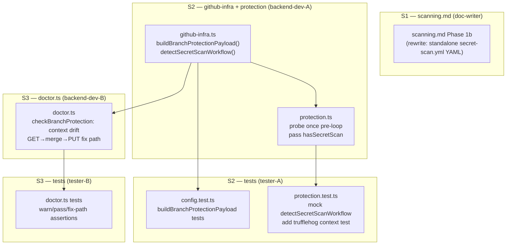
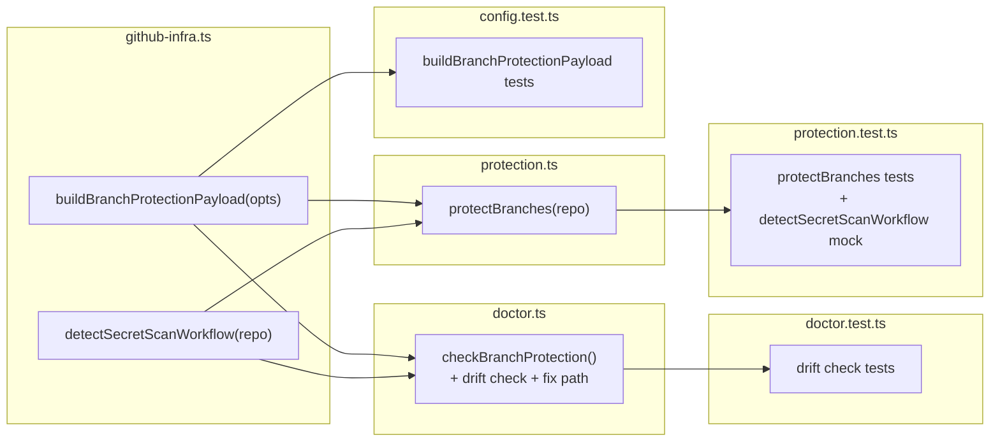

## Summary

Replace the hardcoded `BRANCH_PROTECTION_PAYLOAD` constant and inline `secrets` TruffleHog job with a dynamic `buildBranchProtectionPayload` function, a `detectSecretScanWorkflow` probe, and a standalone `secret-scan.yml` workflow — matching Lyra's reference implementation. `/checkup` gains a drift-detection check that warns when the workflow is present but branch protection doesn't require it.

## Architecture





## Agents

| Agent instance | Tasks | Files |
|---------------|-------|-------|
| doc-writer | T1 | `scanning.md` |
| backend-dev-A | T2, T3 | `github-infra.ts`, `protection.ts` |
| backend-dev-B | T4 | `doctor.ts` |
| tester-A | T5, T6 | `config.test.ts`, `protection.test.ts` |
| tester-B | T7 | `doctor.ts` tests |

## Wave Structure

3 waves, max 2 parallel agents. Elapsed ~30 min vs ~60 min sequential.

| Wave | Trigger | Agents | Tasks |
|------|---------|--------|-------|
| 1 | start | 2 ∥ | doc-writer: T1 · backend-dev-A: T2 |
| 2 | Wave 1 done (T2 required) | 2 ∥ | backend-dev-A: T3 · backend-dev-B: T4 |
| 3 | Wave 2 done | 2 ∥ | tester-A: T5→T6 · tester-B: T7 |

## Ref Patterns

- `doctor.ts:396–406` — `checkBranchProtection` loop pattern: `spawnSync(['gh', 'api', ...])`, build `checks[]`, return `{ name, checks }`
- `github-infra.ts:92–140` — async function export pattern with try/catch + console.error warn
- `protection.test.ts:3–18` — vi.mock pattern for `github-infra` module

## Micro-Tasks

### S1 — scanning.md rewrite

#### T1 [doc-writer] [parallel-safe: Y] [difficulty: 1]

**Description:** Rewrite Phase 1b of `scanning.md` to instruct generating a standalone `.github/workflows/secret-scan.yml` (pushed via REST API) instead of adding a `secrets` job to `ci.yml`. YAML must match Lyra's reference exactly: pinned SHAs for `checkout` (v6) and `trufflehog` (v3.94.3), `cancel-in-progress: false`, `--only-verified`.

**File:** `plugins/dev-core/skills/ci-setup/cookbooks/scanning.md`

**Expected shape:**
```markdown
## Phase 1b — TruffleHog

Ask: **Set up TruffleHog** | **Skip**.
yes:
1. Generate `.github/workflows/secret-scan.yml`:
   ```yaml
   name: Secret Scan
   permissions:
     contents: read
   on:
     push:
       branches: [main, staging]
     pull_request:
       branches: [main, staging]
     workflow_dispatch: {}
   concurrency:
     group: secret-scan-${{ github.ref }}
     cancel-in-progress: false
   jobs:
     trufflehog:
       runs-on: ubuntu-latest
       timeout-minutes: 5
       steps:
         - uses: actions/checkout@de0fac2e4500dabe0009e67214ff5f5447ce83dd  # v6
           with:
             fetch-depth: 0
         - name: TruffleHog secret scan
           uses: trufflesecurity/trufflehog@47e7b7cd74f578e1e3145d48f669f22fd1330ca6  # v3.94.3
           with:
             extra_args: --only-verified
   ```
2. Push via REST API (same pattern as other workflows).
3. Check local binary: ...
```

**Verify:** `grep 'secrets' plugins/dev-core/skills/ci-setup/cookbooks/scanning.md` → 0 hits for "secrets job"; `grep 'secret-scan.yml' ...` → ≥1 hit

**Spec trace:** SC-1 | **Slice:** S1 | **Phase:** RED (doc, no auto-test) | **Est:** 5 min

---

### S2 — github-infra + protection + tests

#### RED-GATE S1→S2

#### T2 [backend-dev-A] [parallel-safe: Y] [difficulty: 2]

**Description:** In `github-infra.ts`: (1) remove `BRANCH_PROTECTION_PAYLOAD` constant; (2) export `buildBranchProtectionPayload(opts: { hasSecretScan: boolean })` returning `BranchProtectionPayload`; (3) export async `detectSecretScanWorkflow(repo: string): Promise<boolean>` — probes `GET /repos/{repo}/contents/.github/workflows/secret-scan.yml`, returns `false` on 404 and on any other error.

**File:** `plugins/dev-core/skills/shared/adapters/github-infra.ts`

**Expected shape:**
```ts
export interface BranchProtectionOpts {
  hasSecretScan: boolean
}

export function buildBranchProtectionPayload(opts: BranchProtectionOpts) {
  const contexts = ['ci']
  if (opts.hasSecretScan) contexts.push('trufflehog')
  return {
    required_status_checks: { strict: true, contexts },
    enforce_admins: false,
    restrictions: null,
  }
}

export async function detectSecretScanWorkflow(repo: string): Promise<boolean> {
  try {
    const proc = Bun.spawnSync(
      ['gh', 'api', `repos/${repo}/contents/.github/workflows/secret-scan.yml`],
      { stdout: 'pipe', stderr: 'pipe' },
    )
    return proc.exitCode === 0
  } catch {
    return false
  }
}
```

**Verify:** `grep 'BRANCH_PROTECTION_PAYLOAD' plugins/dev-core/skills/shared/adapters/github-infra.ts` → 0 lines; `grep 'buildBranchProtectionPayload\|detectSecretScanWorkflow' ...` → 2 lines

**Spec trace:** SC-2, SC-3, SC-4, SC-5 | **Slice:** S2 | **Phase:** RED | **Est:** 8 min

#### T3 [backend-dev-A] [parallel-safe: N] [difficulty: 2] — blocked by T2

**Description:** Update `protection.ts` to import `buildBranchProtectionPayload` + `detectSecretScanWorkflow` (remove `BRANCH_PROTECTION_PAYLOAD`). Call `detectSecretScanWorkflow(repo)` once before the `for (const branch of PROTECTED_BRANCHES)` loop; cache result as `const hasSecretScan`. Inside the loop replace `JSON.stringify(BRANCH_PROTECTION_PAYLOAD)` with `JSON.stringify(buildBranchProtectionPayload({ hasSecretScan }))`.

**File:** `plugins/dev-core/skills/init/lib/protection.ts`

**Expected shape (loop area):**
```ts
const hasSecretScan = await detectSecretScanWorkflow(repo)

for (const branch of PROTECTED_BRANCHES) {
  // ...
  const payload = JSON.stringify(buildBranchProtectionPayload({ hasSecretScan }))
  // ...
}
```

**Verify:** `grep 'BRANCH_PROTECTION_PAYLOAD' plugins/dev-core/skills/init/lib/protection.ts` → 0 lines; `bun run typecheck` passes

**Spec trace:** SC-6, SC-8, SC-9 | **Slice:** S2 | **Phase:** GREEN | **Est:** 5 min

#### T5 [tester-A] [parallel-safe: N] [difficulty: 2] — blocked by T2

**Description:** In `config.test.ts`: (1) replace `BRANCH_PROTECTION_PAYLOAD` import with `buildBranchProtectionPayload`; (2) replace the `describe('BRANCH_PROTECTION_PAYLOAD')` block with `describe('buildBranchProtectionPayload')` covering: `hasSecretScan: false` → `contexts: ['ci']`, `hasSecretScan: true` → `contexts: ['ci', 'trufflehog']`, shape: `not.toHaveProperty('required_pull_request_reviews')`, `required_status_checks.strict === true`.

**File:** `plugins/dev-core/skills/shared/__tests__/config.test.ts`

**Expected shape:**
```ts
const { ..., buildBranchProtectionPayload } = await import('../adapters/github-infra')

describe('buildBranchProtectionPayload', () => {
  it('returns only ci context when hasSecretScan is false', () => {
    const p = buildBranchProtectionPayload({ hasSecretScan: false })
    expect(p.required_status_checks.contexts).toEqual(['ci'])
  })
  it('includes trufflehog context when hasSecretScan is true', () => {
    const p = buildBranchProtectionPayload({ hasSecretScan: true })
    expect(p.required_status_checks.contexts).toEqual(['ci', 'trufflehog'])
  })
  it('does not require approving reviews', () => {
    expect(buildBranchProtectionPayload({ hasSecretScan: false })).not.toHaveProperty('required_pull_request_reviews')
  })
  it('has strict status checks', () => {
    expect(buildBranchProtectionPayload({ hasSecretScan: false }).required_status_checks.strict).toBe(true)
  })
})
```

**Verify:** `cd plugins/dev-core && bun run test shared/__tests__/config.test.ts` passes

**Spec trace:** SC-4 | **Slice:** S2 | **Phase:** GREEN | **Est:** 5 min

#### T6 [tester-A] [parallel-safe: N] [difficulty: 3] — blocked by T3

**Description:** In `protection.test.ts`: (1) replace `BRANCH_PROTECTION_PAYLOAD` mock with mocks for `buildBranchProtectionPayload` (returns the base payload) and `detectSecretScanWorkflow` (default returns `false`); (2) add a test where `detectSecretScanWorkflow` returns `true` and assert the PUT payload contains `'trufflehog'` in `contexts`; (3) verify all 4 existing tests still pass.

**File:** `plugins/dev-core/skills/init/__tests__/protection.test.ts`

**Expected shape (mock):**
```ts
vi.mock('../../shared/adapters/github-infra', () => ({
  PROTECTED_BRANCHES: ['main', 'staging'],
  buildBranchProtectionPayload: vi.fn(({ hasSecretScan }) => ({
    required_status_checks: {
      strict: true,
      contexts: hasSecretScan ? ['ci', 'trufflehog'] : ['ci'],
    },
    enforce_admins: false,
    restrictions: null,
  })),
  detectSecretScanWorkflow: vi.fn().mockResolvedValue(false),
  DEFAULT_RULESET: { /* existing shape */ },
}))
```

**New test:**
```ts
it('includes trufflehog in context when secret-scan.yml is present', async () => {
  const { detectSecretScanWorkflow } = await import('../../shared/adapters/github-infra')
  ;(detectSecretScanWorkflow as ReturnType<typeof vi.fn>).mockResolvedValue(true)
  // ... assert spawn was called with payload containing 'trufflehog'
})
```

**Verify:** `cd plugins/dev-core && bun run test init/__tests__/protection.test.ts` passes (all 5 tests)

**Spec trace:** SC-7, SC-8, SC-9 | **Slice:** S2 | **Phase:** GREEN | **Est:** 8 min

---

### S3 — checkup drift detection + tests

#### RED-GATE S2→S3

#### T4 [backend-dev-B] [parallel-safe: N] [difficulty: 3] — blocked by T2

**Description:** In `doctor.ts`, extend `checkBranchProtection` (line ~388): after the existing per-branch protection check, add a secondary probe: call `detectSecretScanWorkflow(repo)` (import from `github-infra.ts`). For each protected branch where the branch exists and is protected, also `GET /repos/{owner}/{repo}/branches/{branch}/protection` and extract `required_status_checks.contexts`. If `secretScanPresent && !contexts.includes('trufflehog')` → push an additional `warn` check: `{ name: \`${branch}:trufflehog-context\`, status: 'warn', detail: 'secret-scan.yml present but trufflehog missing from required checks — fix: GET+merge+PUT' }`. Also add the fix function (called when user confirms): GET full protection payload, merge `trufflehog` into contexts, PUT full payload back.

**File:** `plugins/dev-core/skills/checkup/doctor.ts`

**Expected shape (additions inside checkBranchProtection):**
```ts
const secretScanPresent = await detectSecretScanWorkflow(`${owner}/${repo}`) // once before loop, cached

// inside per-branch loop, after existing protection check:
if (secretScanPresent && result.ok) {
  const protectionData = spawnSync([
    'gh', 'api', `repos/${owner}/${repo}/branches/${branch}/protection`,
    '--jq', '.required_status_checks.contexts'
  ])
  if (protectionData.ok) {
    const contexts: string[] = JSON.parse(protectionData.stdout || '[]')
    if (!contexts.includes('trufflehog')) {
      checks.push({
        name: `${branch}:trufflehog-context`,
        status: 'warn',
        detail: `secret-scan.yml present but trufflehog missing from required checks — run /init to fix`,
      })
    }
  }
}
```

**Verify:** `bun run typecheck` passes

**Spec trace:** SC-10, SC-11 | **Slice:** S3 | **Phase:** RED | **Est:** 10 min

#### T7 [tester-B] [parallel-safe: N] [difficulty: 3] — blocked by T4

**Description:** Add tests for the new branch protection context drift check in `doctor.ts`. Create `plugins/dev-core/skills/checkup/__tests__/branch-protection-context.test.ts` (or add to existing doctor test file if present). Three test cases: (a) `detectSecretScanWorkflow` returns `true`, GET contexts returns `['ci']` → check result includes a `warn` for that branch; (b) `detectSecretScanWorkflow` returns `true`, contexts include `trufflehog` → no warn; (c) `detectSecretScanWorkflow` returns `false` → no trufflehog-context check at all.

**File:** `plugins/dev-core/skills/checkup/__tests__/branch-protection-context.test.ts` (or existing doctor test)

**Verify:** `cd plugins/dev-core && bun run test` passes (0 failures)

**Spec trace:** SC-10, SC-11, SC-12, SC-13 | **Slice:** S3 | **Phase:** GREEN | **Est:** 8 min

## Consistency Report

| Metric | Count |
|--------|-------|
| SC covered | 13/13 |
| Tasks | 7 |
| Uncovered SC | 0 |
| Untraced tasks | 0 |

SC coverage:
- SC-1 → T1
- SC-2, SC-3 → T2, T5
- SC-4 → T2, T5
- SC-5 → T2
- SC-6 → T3
- SC-7 → T6
- SC-8, SC-9 → T3, T6
- SC-10, SC-11 → T4, T7
- SC-12 → T6, T7
- SC-13 → T6, T7

## Task Seeding Blueprint

<!-- Used by /implement to seed TaskCreate calls on session start. -->

### Wave 1 — no deps, 2 agents ∥

| Task | Agent instance | blockedBy | Subject |
|------|---------------|-----------|---------|
| T1 | doc-writer | — | Rewrite scanning.md Phase 1b → standalone secret-scan.yml |
| T2 | backend-dev-A | — | github-infra.ts: add buildBranchProtectionPayload + detectSecretScanWorkflow, remove BRANCH_PROTECTION_PAYLOAD |

### Wave 2 — after T2, 2 agents ∥

| Task | Agent instance | blockedBy | Subject |
|------|---------------|-----------|---------|
| T3 | backend-dev-A | T2 | protection.ts: probe once pre-loop, pass hasSecretScan to builder |
| T4 | backend-dev-B | T2 | doctor.ts: add branch-protection context drift check + GET→merge→PUT fix path |

### Wave 3 — after Wave 2, 2 agents ∥

| Task | Agent instance | blockedBy | Subject |
|------|---------------|-----------|---------|
| T5 | tester-A | T2 | config.test.ts: replace BRANCH_PROTECTION_PAYLOAD block with buildBranchProtectionPayload tests |
| T6 | tester-A | T3 | protection.test.ts: update mock, add detectSecretScanWorkflow mock + trufflehog context test |
| T7 | tester-B | T4 | doctor.ts tests: add warn/pass/no-probe assertions for context drift check |

## Task IDs

<!-- Generated by /plan. Used by /implement to resume tasks on session restart. -->
- T1: 10 — Rewrite scanning.md Phase 1b → standalone secret-scan.yml
- T2: 11 — github-infra.ts: add buildBranchProtectionPayload + detectSecretScanWorkflow, remove BRANCH_PROTECTION_PAYLOAD
- T3: 12 — protection.ts: probe once pre-loop, pass hasSecretScan to builder
- T4: 13 — doctor.ts: add branch-protection context drift check + GET→merge→PUT fix path
- T5: 14 — config.test.ts: replace BRANCH_PROTECTION_PAYLOAD block with buildBranchProtectionPayload tests
- T6: 15 — protection.test.ts: update mock + add detectSecretScanWorkflow mock + trufflehog context test
- T7: 16 — doctor.ts tests: add warn/pass/no-probe assertions for context drift check
