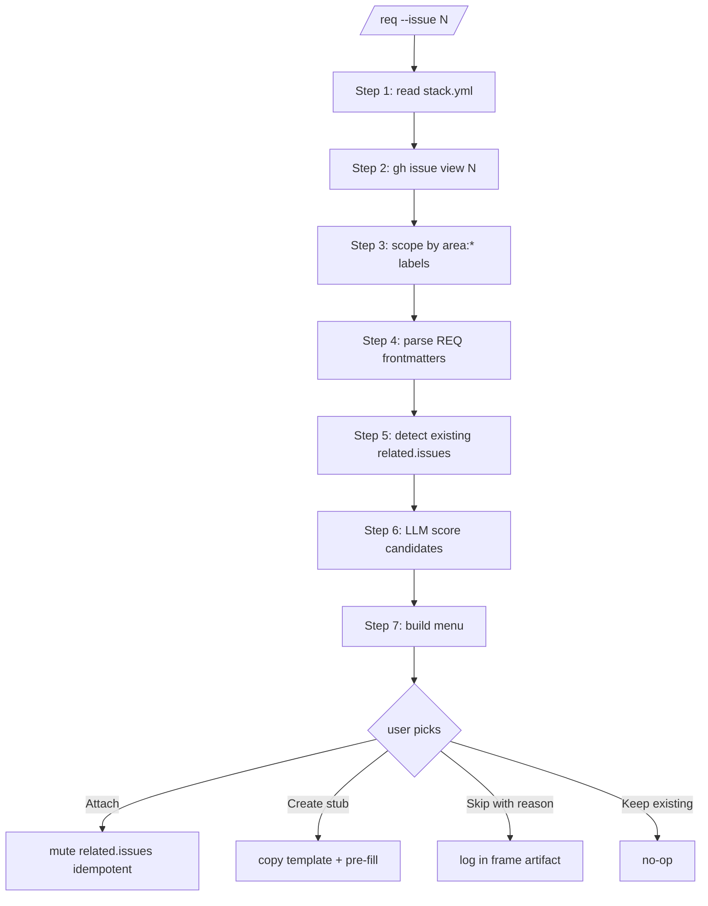

# req

`/req --issue N` — Identify or create a REQ for an issue. Attach to existing, create a pre-filled stub, or skip with a justified reason.

Local addition to dev-core ; auto-invoked by `/dev` between `analyze` and `spec` when activated. Standalone-safe.

## Usage

```bash
/req --issue 42                    # interactive — find REQ for issue #42
```

Invoked automatically by `/dev #42` if `stack.yml.requirements.enabled: true`.

## Activation

Add to `.claude/stack.yml` :

```yaml
requirements:
  enabled: true                            # required
  root: docs/requirements/                 # default
  validateCmd: pnpm requirements:validate  # optional ; run after mutation
  matchModel: claude-haiku-4-5             # default ; LLM for Step 6 scoring
```

When disabled or absent, the skill is a silent no-op (no prompt, no error).

## How it works



## Examples

### Example 1 — Attach to existing REQ

```
$ /req --issue 42
Issue #42 "Coach can cancel a booking and refund the client"
Labels: area:booking, type:feature

Found 3 candidate REQs in functional/booking/. Pick one:

[Attach REQ-BOOKING-003: Annulation par le coach]   (match) — direct match
[Attach REQ-BOOKING-001: Annulation par le client]  (match) — sibling flow
[Attach REQ-BOOKING-002: Email de confirmation]     (low confidence)
[Create new REQ stub]
[Skip with reason]
```

User picks REQ-BOOKING-003 → `related.issues` becomes `[42]`. Idempotent on re-run.

### Example 2 — Create new stub

```
$ /req --issue 42
[...]
[Create new REQ stub]
```

→ Creates `docs/requirements/functional/booking/REQ-BOOKING-004.mdx` :

```yaml
---
id: REQ-BOOKING-004
title: "Coach can cancel a booking and refund the client"
status: draft
priority: should
type: functional
domain: booking
sources:
  - type: discussion
    ref: "Issue #42"
acceptance_criteria:
  - id: AC-1
    given: "[NEEDS CLARIFICATION]"
    when: "[NEEDS CLARIFICATION]"
    then: "[NEEDS CLARIFICATION]"
related:
  issues: [42]
  ...
---
```

User edits ACs manually after creation.

### Example 3 — Skip with reason

```
$ /req --issue 99
[...]
[Skip with reason]

Reason: cleanup chore, no functional requirement
```

→ Appends to `artifacts/frames/99-*-frame.mdx` :

```markdown
## Requirements skipped

**Reason:** cleanup chore, no functional requirement
**Skipped at:** 2026-05-10T14:32:00Z via /req --issue 99
```

Non-blocking — visible in `pnpm requirements:matrix` for traceability.

## Troubleshooting

### No `area:*` label

Skill warns and falls back to global scan of `{root}/functional/**/*.mdx`. More expensive (LLM tokens) but recoverable.

**Fix** : add `area:X` label to issue, re-run.

### REQ frontmatter invalid

Skipped + warned (`WARN: invalid frontmatter in {path}`). Skill continues with valid REQs only.

**Fix** : run `pnpm requirements:validate` to catch the broken file.

### Multiple high-confidence matches

Skill ranks by score, presents all. v1 forces single-pick. To attach multiple REQs, re-run `/req --issue N` after first attach — the second run detects the existing attachment and offers to add another.

### Re-run produces no menu changes

Step 5 detected `related.issues: [N]` already includes the issue. Menu offers `[Keep existing]` first ; selecting it is a no-op.

## Reference patterns

- Same artifact-mutation pattern as `skills/triage/SKILL.md` (file mutation + GitHub API).
- AskUserQuestion + decision-presentation protocol per `skills/shared/references/decision-presentation.md`.
- LLM call follows `claude-api` skill convention (haiku model + prompt cache).

## Related

- [skills/dev/SKILL.md](../dev/SKILL.md) — pipeline integration (Step 7 invocation)
- [skills/spec/SKILL.md](../spec/SKILL.md) — REQ consumption via `related.issues` grep
- [references/llm-match-prompt.md](references/llm-match-prompt.md) — V2 scoring prompt
- [fixtures/](fixtures/) — test data + RED-GATE results
